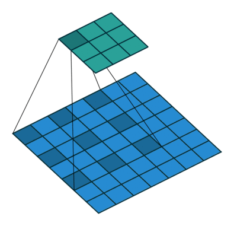
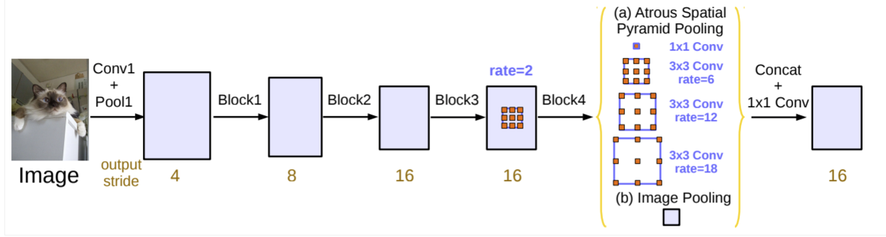
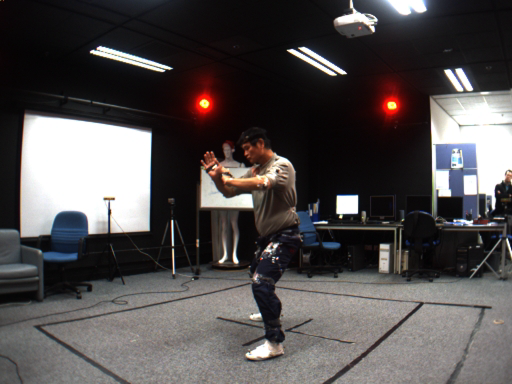
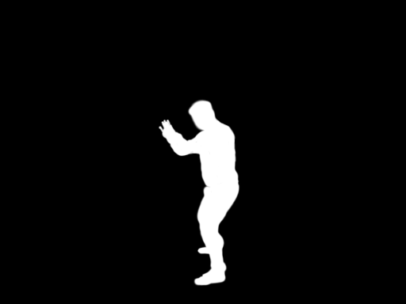
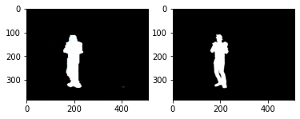

# DeepLabV3+ with TensorFlow

## Motivation

One of the novel AI models is computer vision. There are many different types of computer vision models, such as mask-rcnn, u-net, and so on. This project aims to introduce the state-of-the-art computer vision model, [DeepLabV3+](https://arxiv.org/abs/1802.02611v3). This model is a semantic segmentation architecture, and atrous convolution was introduced in DeepLab as a tool to adjust and control the effective field-of-view of the convolution.
 
The above picture shows how the atrous convolution works. In comparison with regular CNN, the method skips pixels, and this can capture more information about pictures while they are in encoding. 

The below picture shows the entire model architecture, and it shows that the atrous convolution method used in Atrous Spatial Pyramid Pooling (ASPP).
 

## 1.Requiremnents

Python ==> 3.8 
TensorFlow ==> version 2+ 

Assume DataFolder:  
DeepLab  
   ----> Train_Images (for training)  
   ----> Train_Masks (for training)  
   ----> Val_Images (for validation)  
   ----> Val_Masks (for validation)  
   ----> Test_Images (for testing)  
   ----> Test_Masks (for testing)  
   ----> Output (for Saving model)  

## 2.Datsets
Image Resources: [Link](https://www.kaggle.com/tapakah68/segmentation-full-body-mads-dataset) 

Sample Images: 
 

## 3.Demo

https://user-images.githubusercontent.com/52090852/182836463-5320176a-28b5-4eae-81e3-d58cf370b8cd.mp4

## 4.Results

After 20 epochs, DeepLabV3+ predicts those images with high accuracy.

| Train Loss | Dice Coef | IoU | Val Loss| Val Dice Coef | Val IoU |
|:---|:---:|:---:|:---:|:---:|---:|
|0.0730 | 0.9270 | 0.8643 | 0.1173 | 0.8827 |0.7906|

 
